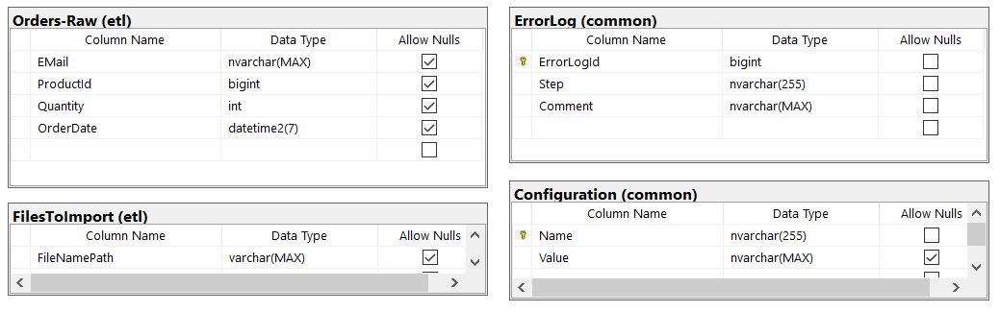

# TestETL #
Testing ETL Example for Microsoft SQL Server 2017+

## Pre-Reqs ##

* Sql Server Express 2017 (or higher)
* Sql Server Management Server (SSMS)

## Loading the DB ##

* In the the file `./sqlexpress/Bicycle.mdf` can be attached to SQL Server Express Instance

## Schemas ##

### Store (Production Schema) ###
![[Store] Schema (Production Data)](Store_Schema.png)

### Other Schemas: Common, Test, ETL ###


## Running the tests ##

The script:

```cmd
adhoc\test_etl_1.sql
```

Chains the ETL and interleaves the tests and some querys as a demo of a potential test chain.

### Pre-requisites ### 

In `common.Configuration` update the value of the path to the data files on your disk.

```sql
USE [Bicycle]
GO

UPDATE [common].[Configuration]
   SET [Value] = '{change this to your path}'
 WHERE [Name] = 'DataFilePath';
```

### Procedure ###

* ETL steps are in the `etl` schema
* Tests are in the `test` schema

Each ETL step is labeled in the form of

```text
[etl].[p##-description].sql
```
Example:

```sql
[etl].[p00-ETL_Setup]
```

Which matches the **test** stored procedure of

```sql
[test].[p##-test]
```
Example:

```sql
[test].[p00-Test]
```

In all cases, the `##` of each ETL step matches the test that goes with it. If there is no `[test]` that matches the [etl] step, then do the next `[etl]` step, and look for a matching test.

### Common Errors ###

Any ETL errors will be in the table `[common].[Errors]`, this table should be empty if [etl] is successful.

At the start of the ETL pipeline the table is truncated, along with any ETL and staging tables.

### Test Design ###

A modified pattern of AAA is used as follows:

* **Pre-Conditions**
    * Error table is empty
    * Starting state is correct
* **Arrange**
    * Sample starting state
    * Identify corresponding ending state
* **Act**
    * Execute ETL step
* **Assert**
    * Do queries to check destination data is as expected

> See code for details...